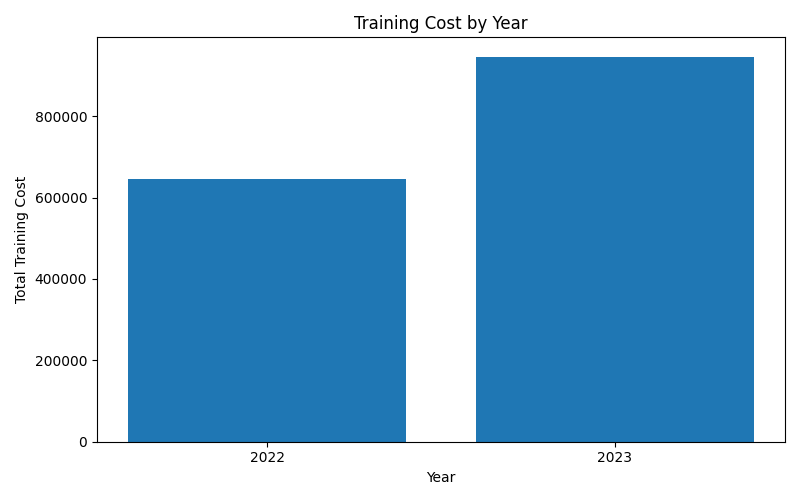
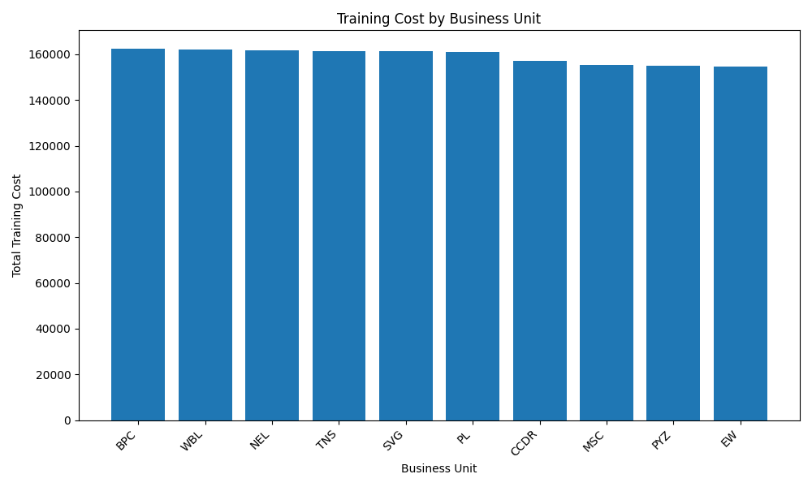

# HRDataProcessing

This is a small C# console app for practicing CSV data processing with .NET.

The project reads employee HR training data from a CSV file, does a few simple calculations, and prints a short summary in the console. It is meant as a learning project for C#, GitHub, and basic data processing.

## What it does

- Loads employee records from `data.csv`
- Sorts employees by training cost
- Shows total training cost by training year
- Finds the training year with the highest total cost
- Generates Tableau-ready CSV summary files in `output/`

## How to run

Run with the default CSV file:

```bash
dotnet run
```

Or pass a CSV file path:

```bash
dotnet run -- data.csv
```

## Sample output

```text
HR Data Processing
==================
File: data.csv
Employees loaded: 2845

Lowest training costs (first 10 records)
--------------------------------------------------
Employee ID  Title                                  Cost Training Date
2406         Network Engineer                    $100.04 19-May-2023
...

Training cost by year
---------------------
2023: $946,244.05
2022: $644,904.58

Most expensive training year
----------------------------
2023: $946,244.05

Generated Tableau-ready CSV files:
- output/training_cost_by_year.csv
- output/training_cost_by_business_unit.csv
- output/top_training_cost_employees.csv
- output/training_program_summary.csv
```

## Tableau Visualization

The app generates simple CSV summaries that can be imported into Tableau. Run:

```bash
dotnet run
```

The generated files will appear in the `output/` folder:

- `training_cost_by_year.csv`
- `training_cost_by_business_unit.csv`
- `top_training_cost_employees.csv`
- `training_program_summary.csv`

Possible dashboard ideas:

- Training cost by year
- Training cost by business unit
- Top employees by training cost
- Training program cost breakdown
- Employee rating vs training cost, using `CurrentEmployeeRating` and `TrainingCost`

The CSV output files can also be opened in Tableau, Excel, or Python.

## Optional Visualization

There is a small optional Python script that turns two generated CSV summaries into chart images.

First, run the C# app:

```bash
dotnet run --project HRDataProcessing.csproj
```

Then create and activate a Python virtual environment:

```bash
cd visualization
python3 -m venv .venv
source .venv/bin/activate
```

Install the Python packages and generate charts:

```bash
python -m pip install --upgrade pip
pip install -r requirements.txt
python visualize.py
```

When finished, you can leave the virtual environment:

```bash
deactivate
```

The generated chart images are saved in:

```text
visualization/charts/
```

If `python3 -m venv .venv` fails because of a local Python version issue, remove the partial environment and create it with a stable installed Python version:

```bash
rm -rf .venv
/Library/Frameworks/Python.framework/Versions/3.10/bin/python3 -m venv .venv
source .venv/bin/activate
```

Generated charts:





## Dataset

The included `data.csv` file contains employee HR and training fields used by `Employee.cs`, including:

- Employee ID
- StartDate
- Title
- BusinessUnit
- EmployeeStatus
- EmployeeType
- PayZone
- EmployeeClassificationType
- DepartmentType
- Division
- DOB
- State
- GenderCode
- RaceDesc
- MaritalDesc
- Performance Score
- Current Employee Rating
- Survey Date
- Engagement Score
- Satisfaction Score
- Work-Life Balance Score
- Training Date
- Training Program Name
- Training Type
- Training Outcome
- Training Duration(Days)
- Training Cost
- Age

Dataset source: Kaggle HR Analytics Dataset  
Link: https://www.kaggle.com/datasets/hopesb/hr-analytics-dataset

This dataset is used here for practice. Check the Kaggle page for the original dataset details and licensing terms.
